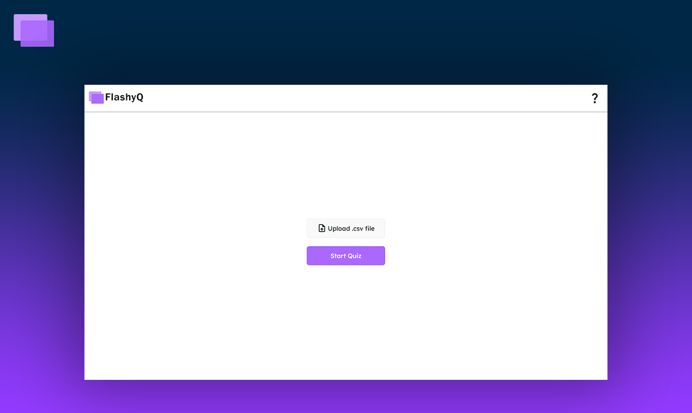
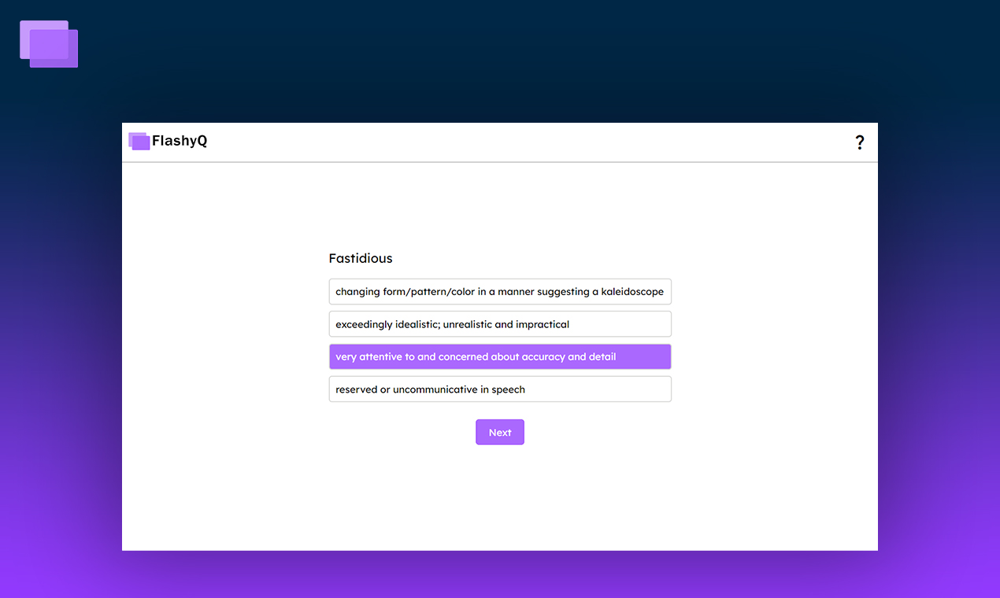
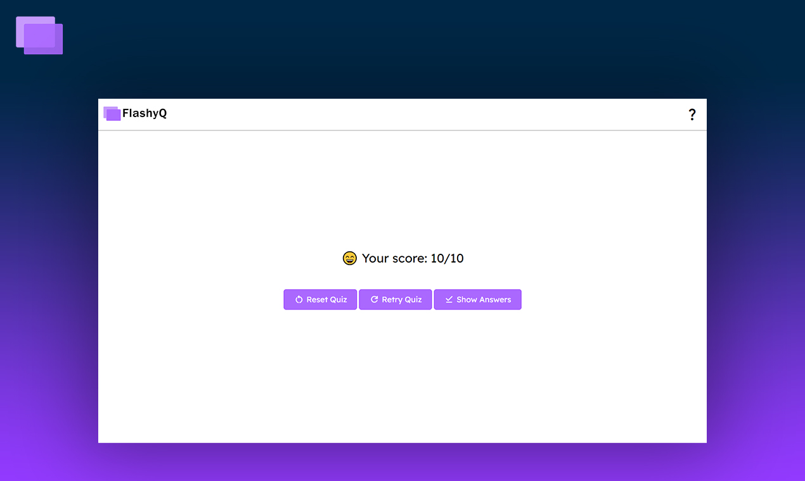
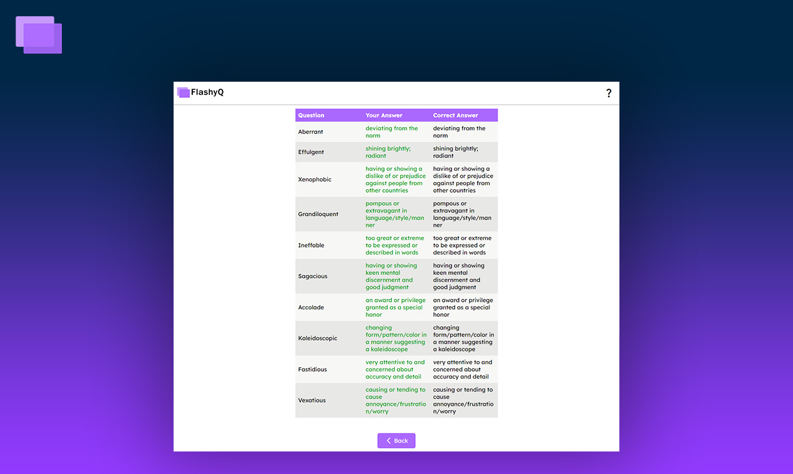

# FlashyQ

_A dynamic quiz app that helps you engage in active recall with your data._

## Features

FlashyQ offers a dynamic quiz environment. For example, if you're a student preparing for your SAT/GRE and need to get a grip on advanced English vocab, you can effectively transition these vocab words from your short-term to long-term memory by using FlashyQ. It's a fun and efficient way to study!

- Simply upload a `.csv` file containing two columns (the first column entries should be questions and the second column entries should be their corresponding answers).
- FlashyQ randomly selects 10 questions from the first column of the uploaded file, ensuring a unique quiz experience each time.
- Each question will have 4 options, ordered randomly (one of these options will be the correct answer, and the other three will be randomly selected from the second column of the uploaded file).
- After completing the quiz, you can view your score, review which questions you answered correctly/incorrectly, and restart the quiz.

## Running FlashyQ locally

Before running FlashyQ locally, ensure you have `Node.js` and `npm` installed on your system. 

Then, start FlashyQ with:

```sh
npm start
```

## Project Structure

The directory structure is as follows:

- `public`: Static assets.
- `src`: The source code for the app.
  - `components`: React components for different parts of the app.
  - `styles`: CSS files for styling the components.

## Screenshots

<p>
  
  
  
  
</p>
